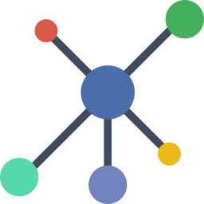
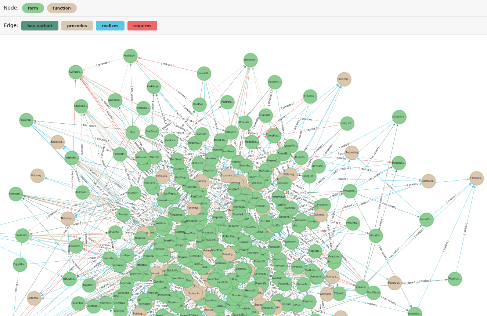

# The L2 Network 

A CEFR-aligned knowledge graph of English grammar for intelligent language tutoring. The graph models **forms** (EGP-derived grammatical patterns at A1-A2 level), the **functions** they serve, and the relations between them.

Built on [Apache AGE](https://age.apache.org/) (a graph extension for PostgreSQL), the graph can be queried with both SQL and openCypher.

## Graph schema

| Vertex type | Description                                     |
|-------------|-------------------------------------------------|
| `form`      | Grammatical pattern (e.g. *SUBJ BE ADJ*)   |
| `function`  | Function (e.g. *Expressing cause*) |

| Edge type     | Description                                    |
|---------------|------------------------------------------------|
| `realizes`    | A form realizes a function                      |
| `requires`    | A form structurally requires another form       |
| `has_variant` | A form has a related variant                    |
| `precedes`    | EGP-derived ordering between forms              |

## Quick start

Requires [Docker](https://docs.docker.com/get-docker/) and [Docker Compose](https://docs.docker.com/compose/).

```bash
# Set a database password (or omit to default to "changeme")
export POSTGRES_PASSWORD=your_password

# Build and start the database and viewer
docker compose up --build -d
```

This will take some minutes. 
Once the containers are running, open **http://localhost:3006** to launch AGE Viewer, then connect with:

| Field    | Value           |
|----------|-----------------|
| URL      | `postgres`      |
| Port     | `5432`          |
| Database | `l2_network`    |
| User     | `postgres`      |
| Password | *(as set above)*|

### Visualizing the graph

To see the entire graph so far, simply click the button [*1927] in AGE Viewer to query all nodes and edges together.



### Example Cypher query

List all functions realized by the PresentSimpleAffirmative:

```sql
SELECT * FROM cypher('domain_graph', $$
    MATCH (f:form)-[r:realizes]->(fn:function)
    WHERE f.name = 'PresentSimpleAffirmative'
    RETURN f, r, fn
$$) AS (form agtype, realizes agtype, function agtype);
```
