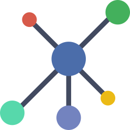
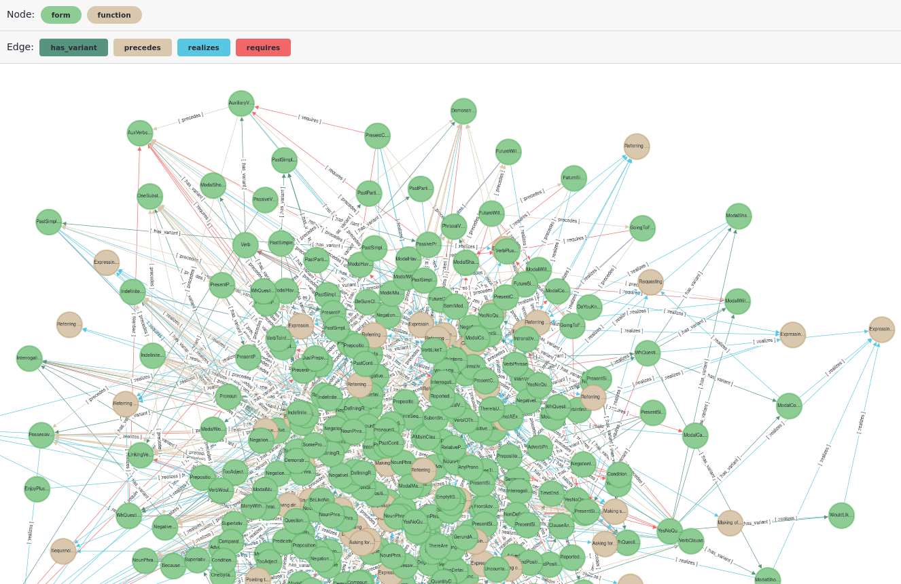

# The L2 Network 

A CEFR-aligned, graph-based domain model for intelligent language tutoring systems (ITSs), currently covering the CEFR leves A1 and A2. It represents grammatical forms, the functions they serve, and the relations between them as a network of connected concepts that can be stored, explored and queried. 

Its grammatical content is informed by the English Grammar Profile ([EGP](https://www.englishprofile.org/english-grammar-profile)), but is not a direct representation of the EGP: its forms and categories have been adapted, and extended to support a relational model of the grammar domain.

Built on [Apache AGE](https://age.apache.org/) (a graph extension for PostgreSQL), the graph can be queried with both SQL and openCypher.

## Graph schema

| Vertex type | Description                                     |
|-------------|-------------------------------------------------|
| `form`      | A grammatical category (e.g. ADJ) or pattern (e.g. *SUBJ BE ADJ*) |
| `function`  | Function (e.g. *Describing*) |

| Edge type     | Description                                    |
|---------------|------------------------------------------------|
| `realizes`    | A form realizes a function                      |
| `requires`    | A form structurally requires another form       |
| `has_variant` | A form has a related variant                    |
| `precedes`    | EGP-derived ordering between forms              |

### On CEFR levels

The `cefr_level` property is used only when a form has been empirically associated with a CEFR level. EGP-based patterns are assigned a level. Broader linguistic categories often are not, as they span multiple levels and group together forms that may each have their own CEFR level.

## Quick start

Requires [Docker](https://docs.docker.com/get-docker/) and [Docker Compose](https://docs.docker.com/compose/).

```bash
# Set a database password (or omit to default to "changeme")
export POSTGRES_PASSWORD=your_password

# Build and start the database and viewer
docker compose up --build -d
```

This will take some minutes. 
Once the containers are running, open **http://localhost:3006** to launch AGE Viewer, then connect with:

| Field    | Value           |
|----------|-----------------|
| URL      | `postgres`      |
| Port     | `5432`          |
| Database | `l2_network`    |
| User     | `postgres`      |
| Password | *(as set above)*|

### Visualizing the graph

To see the entire graph at once, click the button in AGE Viewer labelled with the
graph's edge count — **[*1617]** for `v1.0.0` — which queries all nodes and edges
together.



### Example Cypher query

List all functions realized by the PresentSimpleAffirmative:

```sql
SELECT * FROM cypher('domain_graph', $$
    MATCH (f:form)-[r:realizes]->(fn:function)
    WHERE f.name = 'PresentSimpleAffirmative'
    RETURN f, r, fn
$$) AS (form agtype, realizes agtype, function agtype);
```

## Citation

If you use it in your work, please cite the paper below.

```bibtex
@inproceedings{ribeiroflucht-chen-2026-l2network,
    title     = {The {L2} Network: A {CEFR}-aligned Knowledge Graph for Grammar Domain Modeling},
    author    = {Ribeiro-Flucht, L. and Chen, X.},
    booktitle = {Proceedings of the Workshop on Structured Linguistic Data and Evaluation},
    year      = {2026},
    pages     = {148--159},
    publisher = {{ELRA} Language Resources Association ({ELRA})},
    url       = {https://aclanthology.org/2026.slide-1.pdf#page=162},
    note      = {{CC} {BY-NC} 4.0}
}
```
**Note:** The L2 Network is a work in progress. The paper describes the v0.1.0 pre-release. See the release notes for changes introduced in later versions.